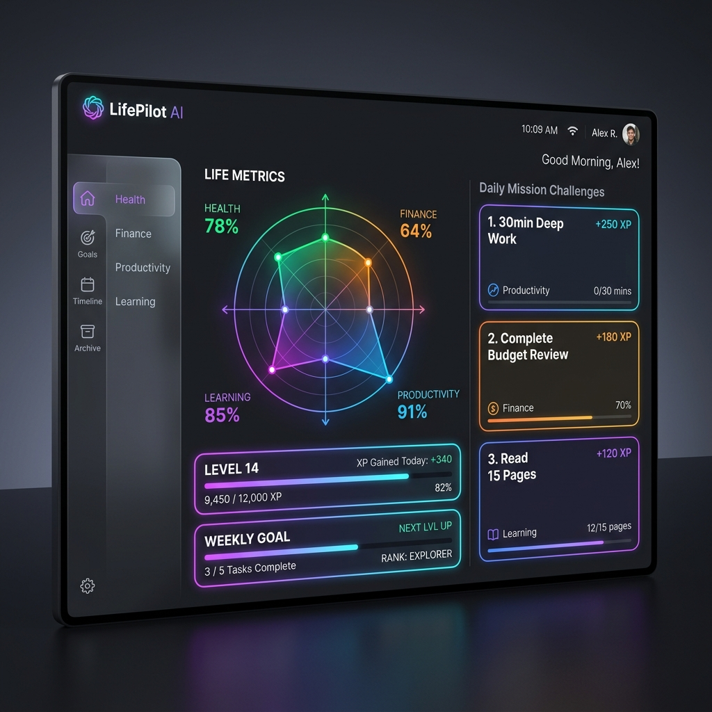
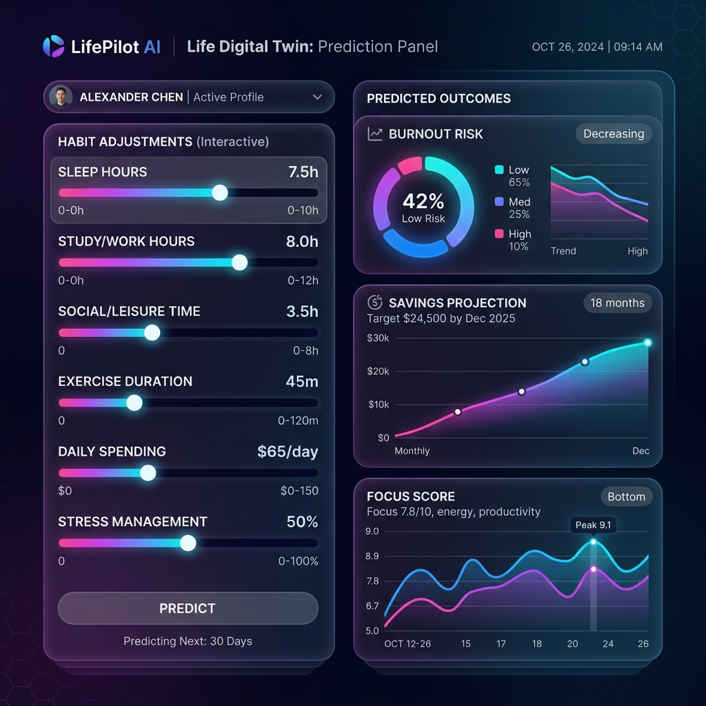

# 🌌 LifePilot AI — Personal Operating System & Digital Twin

<p align="center">
  
</p>

<p align="center">
  <strong>An elegant, dark-first, premium glassmorphic personal operating system and predictive life simulation engine.</strong>
</p>

<p align="center">
  <a href="https://react.dev/"></a>
  <a href="https://typescriptlang.org/"></a>
  <a href="https://fastapi.tiangolo.com/"></a>
  <a href="https://tailwindcss.com/"></a>
  <a href="https://zustand-demo.pmnd.rs/"></a>
</p>

---

## 🌟 Overview & Vision

**LifePilot AI** is a production-grade, AI-driven **Personal Operating System** designed to bridge every aspect of your life—Productivity, Finance, Health, Learning, Career, Relationships, Journaling, Habits, Goals, and Brain Training—into a single unified dashboard. 

Built with a high-end glassmorphic aesthetic inspired by Apple, Linear, Notion, and Arc, LifePilot AI features an advanced **Life Digital Twin** simulation engine and personalized AI feedback loops to keep you optimized, engaged, and motivated.

---

## 📸 Visual Showcase

### 1. Command Center Dashboard
The nerve center of your daily operations. Tracks XP progression, leveling badges, current active missions, and renders your core Life Scores on an interactive radar chart.
<p align="center">
  
</p>

### 2. Life Digital Twin Simulation
Preview habit changes, calculate burnout risk, and simulate financial runways. Our predictive engine projects the future impact of your choices before you make them.
<p align="center">
  
</p>

---

## 🎮 The Core Pillars

### 🧠 Playable Brain Training
Keep your mind sharp with 4 interactive mini-games directly embedded within the interface:
*   **Memory Matrix**: Test spatial memory by remembering active grid sequences.
*   **Reaction Test**: Challenge your visual reaction speeds down to the millisecond.
*   **Color Stroop**: Verify word-color combinations under intense time pressure.
*   **Mental Math**: Solve rapid arithmetic questions to score bonus XP.
*   *Metrics tracked: Accuracy rates, average reaction speed, and cognitive level history.*

### 👥 Life Digital Twin
A sandbox simulation dashboard that behaves like a dashboard forecast.
*   **Slider Adjustments**: Modify daily variables (e.g. Sleep +1.5h, Deep Work +2h, Spending -$20).
*   **Predictive Outputs**: Instant analytics showing burnout risk metrics, projected monthly savings, focus score improvements, and stress indicators.
*   **AI Diagnostics**: Personalized advisory panels detailing recommendations based on current habit-to-outcome projections.

### 🏆 Gamification Mechanics & Missions
*   **XP & Leveling System**: Earn experience points for performing health activities, finishing tasks, or playing brain training mini-games.
*   **Daily, Weekly, & Monthly Missions**: Challenge cards that yield in-game coins and special badges.
*   **Rewards Shop**: Spend accumulated coins to unlock layout customization themes, focus music tracks, and system features.

---

## 📦 The 18-Module Suite

The system is organized into **18 fully-featured modules** designed to replace fragmented tools:

| Category | Module | Key Features & Capabilities |
| :--- | :--- | :--- |
| **Core Control** | **Command Center** | Centralized dashboard tracking active stats, Level, and Radar Chart scores. |
| | **AI Life Analytics** | Correlates health metrics vs productivity vectors (e.g., Sleep vs. Task output). |
| | **AI Life Score** | Radar chart rendering real-time metrics across 6 core lifestyle disciplines. |
| | **Missions & Quests** | Time-sensitive challenge cards that drive routine habit building. |
| | **Gamification Hub** | Level up progression, XP milestones, unlockable customization features. |
| | **Admin Panel** | Tracks system metrics, API token limits, database loads, and feature flags. |
| **Daily Tasks** | **Productivity** | Interactive Kanban board, custom calendar views, and Pomodoro focus timers. |
| | **Habit Tracker** | Streaks tracker, visual consistency calendars, and completion metrics. |
| | **Goals Roadmap** | Long-term milestone planning, roadmaps, and progress track bars. |
| | **Second Brain** | Notes networking, markdown parsing, and quick bookmarks catalog. |
| **Mind & Body** | **Health & Wellness** | Sleep logs, water tracker, calorie tracker, and workout checklists. |
| | **Mood & Journal** | Personal journal editor with AI sentiment analysis and mood tracking. |
| | **Brain Training** | Cognitive mini-games with comprehensive history metrics dashboards. |
| **Career & Finance** | **Finance Manager** | Expense/income trackers, cash flow charts, and AI-powered savings goals. |
| | **Learning Graph** | Book progress tracker, coding streak counters, and React-Flow knowledge graph nodes. |
| | **Career Dashboard** | Job application pipeline Kanban, Resume reviewer, and AI mock interviews. |
| | **Relationships CRM** | Birthday tracking, call log scheduling, and relationship quality index. |
| | **Smart Automations** | Burnout warnings, auto-rescheduling tasks, and budget caps warnings. |

---

## 🛠 Tech Stack

### Frontend
*   **Core**: React 18, TypeScript, Vite
*   **Styling & FX**: Tailwind CSS, Framer Motion (smooth transition animations)
*   **State & Routing**: Zustand (Zustand Global Store), React Router DOM
*   **Data Vis**: Recharts (for finance, health, and twin prediction metrics), React Flow (for interactive note links & learning maps)

### Backend
*   **Server framework**: FastAPI (Python 3.11)
*   **Database**: SQLAlchemy ORM with PostgreSQL (local SQLite for easy setup and testing)
*   **Authentication**: JWT-based Secure OAuth2 (with hashed credentials using bcrypt)
*   **AI Integration**: Google Gemini & OpenAI API clients with reliable routing fallbacks

---

## 📂 Project Structure

```text
LifePilot-AI/
├── backend/                # FastAPI Application
│   ├── app/
│   │   ├── db/            # Database config, SQLite, and base classes
│   │   ├── models/        # SQLAlchemy Models (User, Task, Habit, GameScore, etc.)
│   │   ├── routers/       # Endpoints (Auth, Dashboard, Twin, Games, Modules, etc.)
│   │   ├── utils/         # Helper functions (AI client wrapper, auth helpers)
│   │   └── main.py        # App Entrypoint & FastAPI setup
│   ├── tests/              # Pytest Suite
│   └── requirements.txt   # Python Dependencies
├── frontend/               # React Web Application
│   ├── src/
│   │   ├── assets/        # System icons & static images
│   │   ├── components/    # Layout wrapper, navigation, glassmorphism shells
│   │   ├── pages/         # Page containers (Productivity, Twin, BrainTraining, etc.)
│   │   ├── store/         # Global Zustand slices (authStore, lifeStore, gameStore)
│   │   ├── App.tsx        # Routing configurations & app shell
│   │   └── index.css      # Core styles, animations, CSS variables
│   ├── public/             # Static public assets
│   ├── tailwind.config.js # Custom configurations (extend glow-shadows, animations)
│   └── package.json       # Node.js Dependencies
└── README.md               # Visual Documentation
```

---

## ⚙️ Running Locally

### Prerequisites
*   Node.js (v18+)
*   Python (v3.11+)

### 1. Backend Setup
1. Open a terminal and navigate to the `backend/` directory:
   ```bash
   cd backend
   ```
2. Create and activate a Python virtual environment:
   ```bash
   python -m venv venv
   # On Windows:
   .\venv\Scripts\activate
   # On macOS/Linux:
   source venv/bin/activate
   ```
3. Install dependencies:
   ```bash
   pip install -r requirements.txt
   ```
4. Start the FastAPI development server:
   ```bash
   uvicorn app.main:app --reload
   ```
   *The backend will run on `http://127.0.0.1:8000`. You can access interactive Swagger documentation at `http://127.0.0.1:8000/docs`.*

### 2. Frontend Setup
1. Open a new terminal window/tab and navigate to the `frontend/` directory:
   ```bash
   cd frontend
   ```
2. Install npm packages:
   ```bash
   npm install
   ```
3. Start the Vite development server:
   ```bash
   npm run dev
   ```
   *The client application will spin up at `http://localhost:5173`. Open this URL in your browser to interact with LifePilot AI.*

---

## 🔒 Security & Best Practices
*   **Passwords**: Managed using secure hashing (`passlib` with bcrypt).
*   **JWT Handshakes**: Session validation keys expire automatically.
*   **Fallback AI Clients**: Built-in intelligence routes to alternate model configurations if default AI nodes time out.
